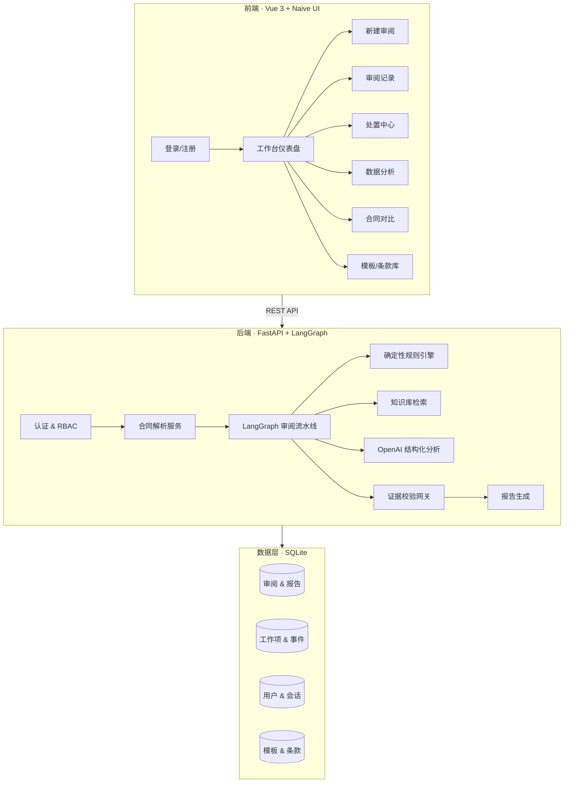
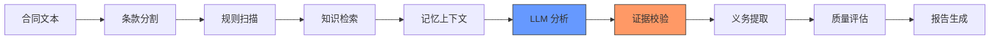
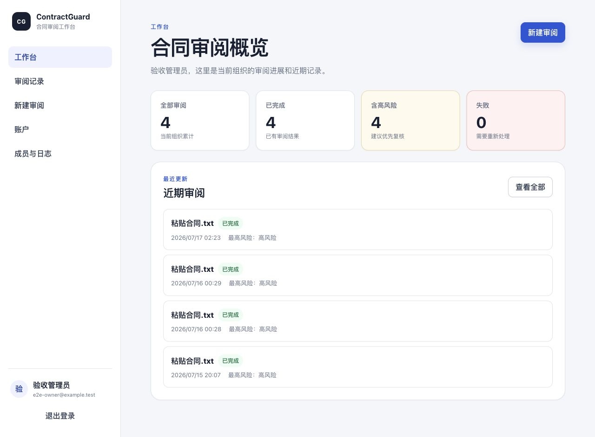
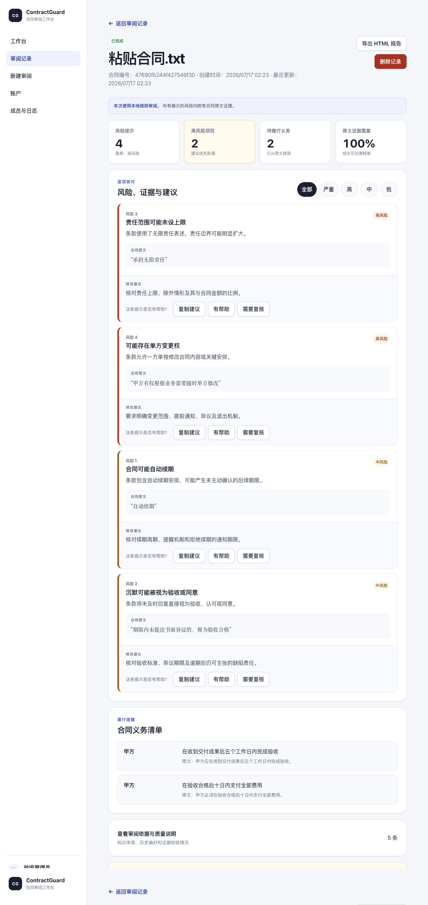
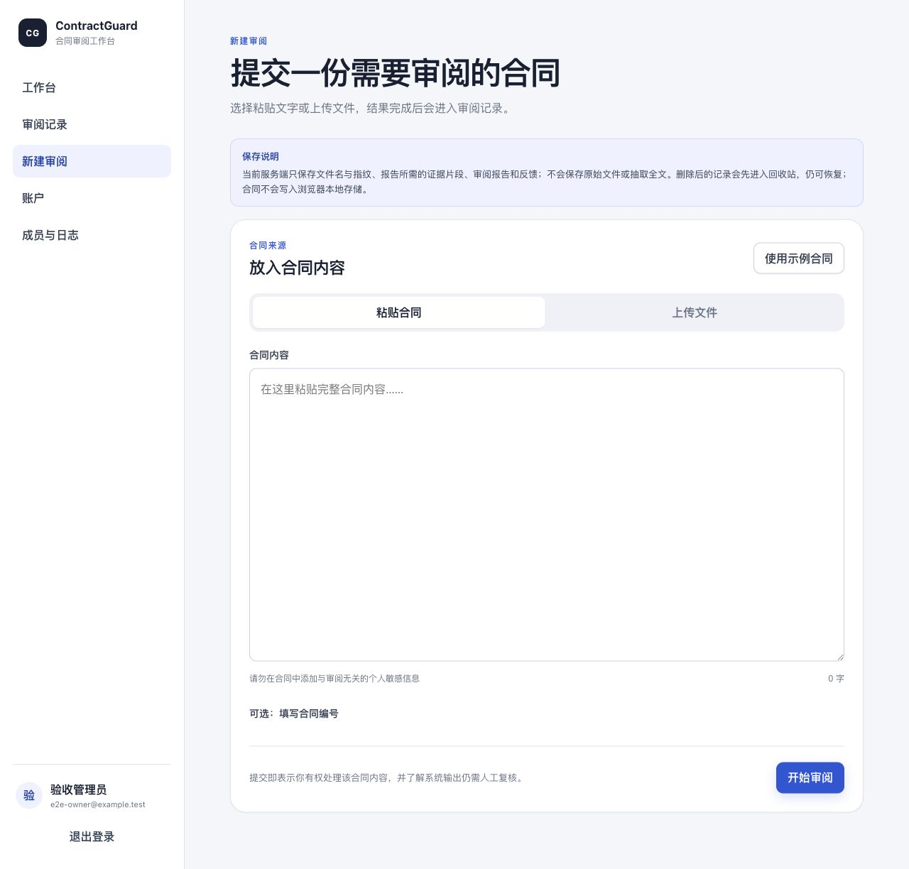
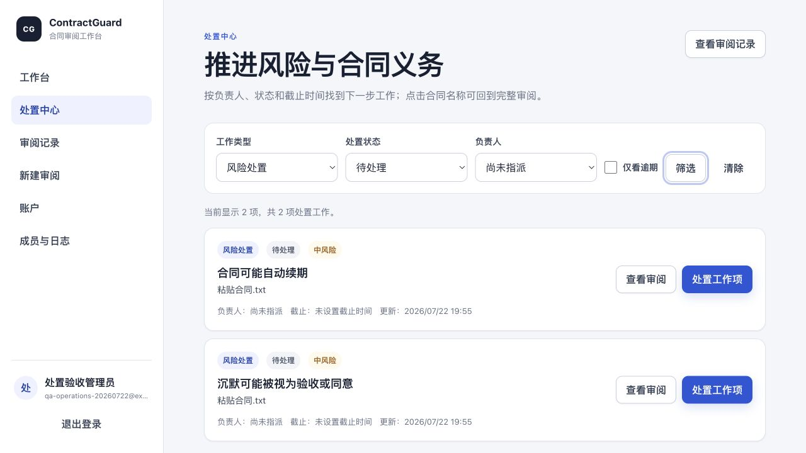

# ContractGuard

**AI 驱动的合同风险审阅与处置工作台**

[](https://python.org)
[](https://fastapi.tiangolo.com)
[](https://vuejs.org)
[](https://typescriptlang.org)
[](https://naiveui.com)
[]()

ContractGuard 将合同解析、确定性规则引擎、可选 AI 复核、可追溯证据校验、风险处置工作项、审批闭环、数据分析、合同对比和模板协作组织成一条完整流程，帮助法务与业务人员从发现问题推进到明确处置结果。

> **法律免责声明：** 本项目仅用于软件开发与辅助预审，不构成法律意见。自动分析可能遗漏风险或产生误报，不能作为签署、诉讼或其他高风险决定的唯一依据。

---

## 系统架构



### 审阅流水线



> 证据校验网关是核心安全机制：任何 AI 生成的发现都必须引用合同原文中可验证的逐字证据，否则整条发现将被拒绝（反幻觉）。

---

## 功能概览

| 模块 | 能力 |
|:---:|:---|
| 🔐 **认证与权限** | 本地账号 + salted scrypt 密码、四角色 RBAC（owner/admin/reviewer/viewer）、组织隔离、审计日志 |
| 📄 **合同解析** | PDF、DOCX、TXT、Markdown、图片 OCR（Vision）；上传预算控制 |
| 🔍 **风险审阅** | 6 条确定性规则 + 可选 OpenAI 结构化复核；原文证据校验；修改建议 |
| 📋 **义务提取** | 自动识别"应当/必须/不得/shall/must"条款，提取义务方、行为、期限、条件 |
| ⚙️ **处置中心** | 风险/义务工作项、负责人指派、截止时间、状态机流转、事件时间线、乐观锁 |
| ✅ **审批闭环** | draft → in_review → approved/rejected；高风险未关闭时阻止批准 |
| 📊 **数据分析** | 风险趋势图、审阅效率、团队工作量、风险类别分布（ECharts 可视化） |
| 🔄 **合同对比** | 条款级 diff（增/删/改高亮）+ 风险 delta（新增/消除/未变化） |
| 📚 **模板 & 条款库** | 合同模板 CRUD、可复用条款库（带风险标注）、一键复制 |
| 🌙 **暗色模式** | 跟随系统偏好 + 手动切换，全组件适配 |
| 📱 **响应式** | 桌面/平板/手机三端适配，移动端抽屉式导航 |

---

## 界面预览

| 工作台 | 审阅详情 |
|:---:|:---:|
|  |  |

| 新建审阅 | 处置中心 |
|:---:|:---:|
|  |  |

---

## 技术栈

| 层面 | 技术 |
|:---|:---|
| 前端框架 | Vue 3 + TypeScript + Vite |
| UI 组件 | Naive UI（暗色模式原生支持） |
| 状态管理 | Pinia |
| 图表 | ECharts + vue-echarts |
| 后端框架 | FastAPI + Uvicorn |
| AI 流水线 | LangGraph StateGraph（9 节点） |
| LLM 集成 | OpenAI Responses API（可选） |
| 数据库 | SQLite（WAL 模式，版本化迁移 V1–V4） |
| 部署 | Docker 多阶段构建 / Kubernetes 单副本 |

---

## 快速开始

### 环境要求

- Python 3.12+
- Node.js 20+（前端开发/构建）

### 安装与启动

```bash
# 后端
make install
cp .env.example .env.local
make dev                    # → http://127.0.0.1:8010

# 前端开发（可选，热更新）
make frontend-install
make frontend-dev           # → http://127.0.0.1:5173（代理 API 到 :8010）
```

### 首次使用

全新数据库会自动引导创建管理员账号：

1. 访问 `http://127.0.0.1:8010`
2. 填写组织名称、姓名、邮箱
3. 设置密码（≥12 位，含大小写/数字/符号中至少 3 类）
4. 第一个账号自动成为 `owner`

### 运行模式

| 模式 | 配置 | 行为 |
|:---|:---|:---|
| 离线 | `APP_MODE=offline`（默认） | 本地规则 + 证据校验，无需 API Key |
| 混合 | `APP_MODE=hybrid` + `OPENAI_API_KEY` | 规则 + AI 结构化复核 + Vision OCR |

---

## 项目结构

```
ContractAI/
├── frontend/                     # Vue 3 SPA（Vite + TypeScript）
│   ├── src/
│   │   ├── api/                  # API 客户端层
│   │   ├── stores/               # Pinia 状态管理
│   │   ├── router/               # 路由 + 导航守卫
│   │   ├── views/                # 页面组件（9 个视图）
│   │   ├── components/           # 布局 + 通用 + 图表组件
│   │   ├── composables/          # 组合式函数
│   │   └── styles/               # CSS 变量 + 过渡动效
│   └── vite.config.ts
├── src/contract_guard/
│   ├── agent/                    # LangGraph 审阅流水线
│   ├── api/                      # FastAPI 路由（7 个模块）
│   ├── domain/                   # 领域模型 + 状态机
│   ├── infrastructure/db/        # SQLite 迁移（V1–V4）
│   ├── services/                 # 业务服务层
│   └── web/                      # Vue 构建输出（生产）
├── tests/                        # 85 个后端测试
├── docs/                         # 文档 + 截图
├── deploy/                       # Kubernetes 清单
├── Dockerfile                    # 三阶段构建（Node → Python → Runtime）
├── docker-compose.yml
├── Makefile
└── pyproject.toml
```

---

## API 概览

| 模块 | 端点 | 说明 |
|:---|:---|:---|
| 认证 | `POST /auth/register, /login, /refresh, /logout` | 会话生命周期 |
| 审阅 | `POST /reviews/text, /reviews` | 提交合同审阅 |
| 审阅 | `GET /reviews, /reviews/{id}` | 列表/详情 |
| 审阅 | `DELETE /reviews/{id}`, `POST /reviews/{id}/restore` | 软删除/恢复 |
| 审阅 | `GET /reviews/{id}/export?format=html` | 报告导出 |
| 审批 | `PATCH /reviews/{id}/decision` | 审批状态流转 |
| 处置 | `GET /work-items`, `PATCH /work-items/{id}` | 工作项管理 |
| 处置 | `GET /work-items/{id}/events` | 事件时间线 |
| 分析 | `GET /analytics/overview, /risk-trends, /efficiency, /workload, /risk-categories` | 数据分析 |
| 对比 | `POST /compare` | 合同条款对比 |
| 模板 | `GET/POST/PATCH/DELETE /templates, /clauses` | 模板 & 条款库 |
| 成员 | `GET/POST/PATCH /users` | 成员管理 |
| 审计 | `GET /audit-logs` | 操作日志 |
| 系统 | `GET /health, /live, /ready` | 健康检查 |

完整交互式文档：`http://127.0.0.1:8010/docs`

---

## 开发命令

```bash
make check              # 全量质量门禁（lint + typecheck + tests + 前端 typecheck）
make test               # 后端测试（85 个）
make lint               # Ruff lint
make type-check         # Mypy
make frontend-check     # Vue TypeScript 检查
make frontend-build     # 构建前端
make frontend-deploy    # 构建并部署到 web/
make db-status          # 数据库迁移状态
make db-backup BACKUP=backups/pre.db
make docker-build       # Docker 镜像
```

---

## 配置

完整模板见 [`.env.example`](.env.example)。核心变量：

| 变量 | 默认值 | 说明 |
|:---|:---|:---|
| `APP_MODE` | `offline` | `offline` 或 `hybrid` |
| `OPENAI_API_KEY` | 空 | 混合模式必需 |
| `OPENAI_MODEL` | `gpt-5.6-luna` | LLM 模型 |
| `DATABASE_URL` | `sqlite:///./data/contractguard.db` | SQLite 路径 |
| `CONTRACT_GUARD_AUTH_REQUIRED` | `true` | 强制登录 |
| `CONTRACT_GUARD_MAX_UPLOAD_BYTES` | `20971520` | 上传上限 20 MiB |

---

## 数据库迁移

当前最新 V4（`templates_clause_library`），新增合同模板和条款库表。

```bash
make db-status          # 查看当前版本
make db-upgrade         # 升级到最新
make db-backup BACKUP=backups/v4.db
make db-restore BACKUP=backups/v4.db
```

---

## 部署

```bash
docker compose up --build    # → http://127.0.0.1:8010
```

Dockerfile 采用三阶段构建：Node 20 编译前端 → Python 3.12 打包 wheel → 精简运行时镜像。Kubernetes 清单见 [`deploy/README.md`](deploy/README.md)。

> 当前仅支持单实例 SQLite 部署。Redis/Kafka/Neo4j/Milvus 容器为实验性 profile，尚未接入默认运行路径。

---

## 安全边界

- 合同文本和上传文件视为不可信输入，资源预算控制复杂度但不能替代恶意文件扫描
- 密码使用 salted scrypt，令牌只存 SHA-256 摘要，会话 HttpOnly + SameSite=Strict
- AI 输出必须通过证据校验网关，不允许无原文支撑的发现
- 生产环境必须启用 HTTPS + Secure Cookie + 受管密钥
- 数据库、PVC 和备份需实施加密、访问控制和保留/销毁策略

---

## 相关文档

- [重构报告](docs/REFACTOR_REPORT.md) — 架构演进全记录
- [迁移手册](docs/MIGRATIONS.md) — 数据库操作指南
- [部署指南](deploy/README.md) — Kubernetes 与生产配置
- [示例合同](examples/示例软件服务合同.md) — 含典型风险条款
